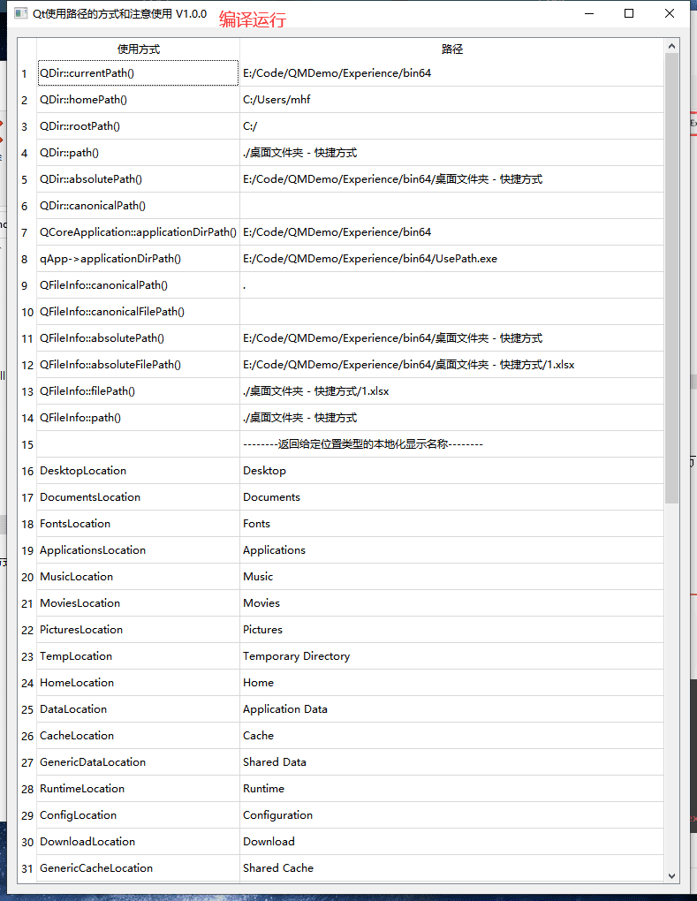

# Qt日常开发经验

[toc]

---

## 1、说明

|  类名   | 功能                       |
| :-----: | -------------------------- |
| UsePath | Qt使用路径的方式和注意事项 |
|         |                            |
|         |                            |
|         |                            |

 

## 2、相关博客

|                           相关博客                           |
| :----------------------------------------------------------: |
| 👉[CSDN](https://blog.csdn.net/qq_43627907/category_11794843.html)👈 |

## 3、实现效果

### 1.1 VideoPlay

> 1. 在程序开发中我们会经常使用到路径功能，例如：读取./路径下的配置文件，将日志文件、运行数据保存到当前路径，将视频文件保存到系统的视频文件夹下等；
> 2. 很多人开发时图方便就使用相对路径，然后用户使用时程序就出问题了，这就需要文件路径指定正确了，否则就会开发不规范，调试两行泪；
> 3. 路径分为相对路径、绝对路径；
> 4. 在Windows下文件/文件夹又有实际路径，快捷方式路径；
> 5. 在Linux下文件/文件夹又有实际路径，软/硬链接路径；
> 6. 程序运行方式有Qt编译运行，双击可执行程序运行，双击快捷方式运行，命令行./运行等；
> 7. 这些不同的组合就会导致使用的路径存在不同的情况，也决定了你写的程序能不能正常的运行，所以我就整理了一下Qt中使用路径的方式和注意事项，避免以后程序出现问题。
> 8. 实际开发中使用相对路径不是很安全，使用绝对路径又由于不同的电脑中路径不一定相同，所以最好的方式是将相对路径根据系统环境不同、运行方式不同转为绝对路径，或者使用系统中的默认路径（例如图片/视频/文件/下载/用户）。

